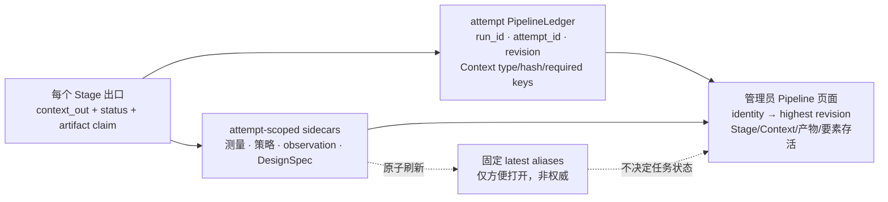

# 当前地图生成 Pipeline

> 2026-09-08：用户批准 B＋C。新 C / block-first active 路线由 S5 冻结
> `z_texture`，S6 生成低坡块平顶和来源绿地内微纹理计划，S7 GLB / S8 复用
> 同一地形＋细节实体。DEM、道路缝宽、核心高度和 vegetation 默认关闭不变。
> 本地接入与局部真实网格回归完成；未部署、未整城／切片验收。见
> [`z_texture_BC_pipeline_20260908.md`](z_texture_BC_pipeline_20260908.md)。
> 以下“未添加随机纹理”是早期记录；新版合成地表纹理只按上述显式政策启用。

> 2026-09-06：道路接地与源线直桥岸点平面已接入新 S6/S8，普通道路按地形分片，
> 直桥不跟随河床。复杂／缺岸桥明确阻断，最终组合和切片仍待验。
> 见 [`road_grounding_item3_20260906.md`](road_grounding_item3_20260906.md)。

> 2026-09-06：测量报告 v3 新增“几何完整性与接地检测”，区分造型测量、
> 本次实体检测、最终组合／切片验收。S8 保存独立报告，管理员优先读取
> S10 → S8 → S7，缺失证据不显示通过。见
> [`geometry_inspection_report_20260906.md`](geometry_inspection_report_20260906.md)。

> 2026-09-06 第三项进行中：冻结地形的取高已改为实际三角面插值，
> 替换最近 8 点最高值，GLB/正式准备表面共用。本轮组合 101 项回归通过。
> 新运行已在 S6 冻结街块接地与建筑平屋顶分片，S8/GLB 共用；旧快照仍为质心平挤出。
> 道路、桥岸衔接及水体布尔裁切后接触尚未完成，不代表整项验收。
> 见 [`z_grounding_item3_20260906.md`](z_grounding_item3_20260906.md)。

> 2026-09-06 第二项：S6 道路宽度集中到 `road_width_contract.py`，区分负空间、
> 正实体和多材料验证责任。0.28/0.42 与 0.55/0.84 分属显式视觉预设，硬件 profile
> 与正式门槛未改。12 块单材料小样显示空槽和凸条不能共用宽度下限；多材料、坡地、
> 弯道尚未验证。见 [`road_width_contract_20260906.md`](road_width_contract_20260906.md)。

> 2026-09-06：第一项整改已增加显式 S6 `--urban-organization C` 与
> `--surface-road-style negative-space-v1`，将连续性恢复、负空间裁切、分裂高度归属
> 接入共享平面，PNG/GLB/3MF 共用；生产默认与打印阈值未变。
> 当前是小范围自动回归，不是巴黎整城或切片验收。见
> [`negative_space_s6_integration_20260906.md`](negative_space_s6_integration_20260906.md)。

> 2026-09-06：地表微起伏属于正式产物应保留的几何细节，不以“低于打印层高”
> 为删除理由。S8 `materialize_terrain_surface_plan` 在网格修复后逐点核对冻结的
> TerrainSurfacePlan 顶面，偏差超过 1e-6 mm 即拒绝，并记录
> `microrelief_preservation`。该检查只覆盖地形网格构建，不代表布尔裁切、上层覆盖
> 后的最终可见表面或切片已验收。源 DEM 降噪策略未改，未添加随机纹理，vegetation
> 仍默认关闭。受控 0.07 mm 起伏保留与错误层高取整拒绝测试通过；实际切片证据见
> [`microrelief_slice_validation_20260906.md`](microrelief_slice_validation_20260906.md)。
> 待完成：西溪局部最终组合模型的可见表面检查及实际切片；来源不足的风格化肌理
> 需独立策略与土地用途约束，不能冒充真实 DEM。

> 2026-09-05 最新执行约束：[`canonical_surface_execution.md`](canonical_surface_execution.md)。
> 新任务主入口 `generate_model.py` 固定 canonical-v1。S6 的 shared-city-surface-v2
> 固定城市块面、地标、连续道路面域及高度；S7/S8 共用严格挤出，核对实际产物而非仅输入。
> prepared 路径禁用旧纹理/随机扰动，缓存绑定 PBF 和投影数据内容。以下 v1 及历史实验
> 记录不代表最新整城验收；本次未部署。

> 2026-09-05：巴黎阶段一致性修复（本地，未部署）。
> 详见 [`shared_city_surface_plan.md`](shared_city_surface_plan.md)。所有 snap 模式的
> S3 都按实际取景框、实际比例计算，snap 仅复用原始数据。
> `--merge-layers` 下 S6 输出最终道路裁切的城市平面，S7/S8 共用同一几何指纹；
> S8 不再随机旋转/平移或重新裁切该平面，不再把 BO 高度统一覆盖为 0.625 mm。
> 非 merge 调用保留旧 builder 路径；不宣称已完成所有模式迁移或整城打印验收。

> S5 高质量建筑数据保真过滤实验（2026-09-03）：
> [`dense_source_filtering_v7.md`](dense_source_filtering_v7.md)。
> 完整数据在打印下限处停止聚合的实验未通过芝加哥 A/B，默认关闭，未发布。
> 本次落地的是源数据退让/塑形保留率观测、诊断比例检查，以及回退不可冒充候选的验收规则。

> 地形专用质量门：正式整城重跑前，先运行
> `tools/generate_terrain_diagnostic.py`。输出、测量项和验收阈值见
> [`terrain_quality_diagnostic.md`](terrain_quality_diagnostic.md)。

> 当前执行契约更新日期：2026-09-05；下文带日期的实验记录保留原始状态。
>
> 范围：只描述数据、构图、几何、预览、3MF 导出、验收及其管理员只读观测投影；
> 不包含账号、订单、队列、面向客户的 Web 展示和画廊发布。
>
> 植被源数据参与 S1–S5 的场景测量，但植被几何覆盖层默认关闭。只有显式
> `--vegetation` 才会让 S7 预览和 S8 正式网格生成该层；DesignSpec/S9 会把默认关闭
> 记录为 `intentionally_omitted`，避免测量数据被误当成必须导出的实体。
>
> 图按 `generation-pipeline-contract-v3` 表达。生命周期顺序和摘要 Context 的必需
> 交接字段已由 contract/ledger 强制；领域对象执行仍在迁移。S3→S10 已由
> `pipeline-domain-context-v1` 的生产 adapter 串联，`LayerPolygons` 与 JSON 证据以
> 只读 snapshot 跨 Stage；S4–S10 的 ledger evidence 由实际 Runtime Context 派生并
> 绑定 run/attempt。V8 绑定完整 mesh 坐标/拓扑指纹，V9 只读验证同一 bundle，V10
> 绑定六件套逐文件 SHA-256。S8 builder 与 S10 文件 effect 仍在大型过程函数中，
> 但其输出不再靠 loose locals 交接；S0–S3 的 GeoDataFrame/DEM 仍待同等级迁移。完整的
> “已强制 / 部分实现 / 未接通”审计见
> [`pipeline_architecture_audit_2026-08-31.md`](pipeline_architecture_audit_2026-08-31.md)。

```mermaid
flowchart TB
    S0["Stage 0 · Resolve RunSpec<br/>bbox · 模型尺寸 · printer profile · 参数<br/>运行模式 · PBF 身份"]
    C0["PipelineContext v0<br/>ResolvedRunSpec + 部分 SourceIdentity"]

    S1["Stage 1 · 获取原始数据<br/>osmium 原生/portable 提取 OSM<br/>读取 SRTM · 可选 nDSM/高度来源"]
    C1["PipelineContext v1<br/>RawData：建筑/道路/水体/植被/landuse/DEM"]

    S2["Stage 2 · 投影、源测量与预处理参数<br/>WGS84 → UTM · bbox 裁切 · 非零要素<br/>CityProfile/auto resolver · 冻结 S3 参数 · TerrainSurfacePlan"]
    C2["PipelineContext v2<br/>ProjectedData + SourceEvidence + Scale<br/>PreprocessParameters + TerrainSurfacePlan"]

    S3["Stage 3 · 消费 S2 参数快照，预处理与构图<br/>道路完整路径分组、高德骨架约束、道路角色/宽度<br/>水体主次、基础建筑候选、植被<br/>道路/水体硬边界 → topology blocks → Baseline BO/Block Base"]
    C3["PipelineContext v3<br/>BaseLayers + Baseline + Topology<br/>CompositionEvidence"]

    S4["Stage 4 · SceneCharacter 测量<br/>建筑密度/分布 · Block Grammar 粒度/轮廓/方向<br/>路网结构 · 水岸/河轴 · DEM 起伏 · 开放空间 · 数据置信度"]
    C4["PipelineContext v4<br/>BaseLayers + SceneCharacter"]

    S5["Stage 5 · S6–S8 下游 ScenePolicy 决策<br/>结合 SceneCharacter、printer profile 和参考 Demo 统计包络<br/>解析建筑粒度、高度与构图策略；不回改已完成的 S3"]
    C5["PipelineContext v5<br/>BaseLayers + SceneCharacter + ScenePolicy"]

    S6["Stage 6 · 建筑中频与共享城市平面<br/>topology block 内有界聚合 → quiet/urban mass → 高度角色<br/>批准道路最终裁切 → 连续道路面域及桥梁约束<br/>冻结块面/地标/道路轮廓、高度与指纹"]
    C6["PipelineContext v6<br/>Final LayerPolygons + 城市平面/街缝<br/>BuildingMass / HeightHierarchy / SurfacePlan 证据"]

    S7["Stage 7 · 诊断证据与构图<br/>从 Final LayerPolygons 生成 PNG 与可选 Draft GLB<br/>输出 CompositionSpec 与测量报告；不构成独立硬门禁"]
    C7["PipelineContext v7<br/>ReviewArtifacts + CompositionSpec + 报告"]

    S8["Stage 8 · 正式网格生成<br/>地形 · 建筑 · 道路 · 水体 · 可选植被 · Block Base<br/>城市块面/道路/地标严格挤出，不随机扰动或重切<br/>逐块核对 footprint / Z / 体积 / 数量及实际 mesh 指纹"]
    C8["PipelineContext v8<br/>SemanticMeshBundle + mesh 摘要"]

    S9["Stage 9 · 间隙、几何与来源存活门禁<br/>精确角色集 · 正顶点/面 · 有限 bounds · 水密 · 绕向<br/>Block Base 道路间隙 · 来源族不得静默归零"]
    C9["PipelineContext v9<br/>VerifiedSemanticMeshBundle + GeometryEvidence<br/>BinaryNonzeroSurvivalEvidence"]

    S10["Stage 10 · 导出<br/>多对象/多材料 3MF + design_spec.json<br/>写入输入、策略、数量、间隙、Z 审计和 artifact 哈希"]
    C10["PipelineContext v10<br/>精确六件套：3MF + DesignSpec<br/>measurement/observation JSON + HTML"]

    S11["Stage 11 · 正式验收<br/>系统重跑项目验证器 V1–V17<br/>校验 hash-bound 受信切片声明 · 前后复核 artifact 身份"]
    RESULT{"AcceptanceReport"}
    PASS["VALIDATED<br/>0 errors · 0 warnings<br/>仍不等于实体打印证明"]
    REVIEW["RERUN / HUMAN REVIEW<br/>保留完整失败证据"]

    S0 --> C0 --> S1 --> C1 --> S2 --> C2 --> S3 --> C3
    C3 --> S4 --> C4 --> S5 --> C5 --> S6 --> C6
    C6 --> S7 --> C7 --> S8 --> C8 --> S9 --> C9
    C9 --> S10 --> C10 --> S11 --> RESULT
    RESULT -- "硬门槛全部通过" --> PASS
    RESULT -- "任一门槛失败或审美待定" --> REVIEW
```



生成链与管理员可视化通过证据联动，而不是让页面反向控制生成：



## Canonical Stage 契约

以下第一条在 S3→S10 已落地，在完整 S0→S11 仍是目标接口：

- 目标：下一级只接收上一级返回的 typed `PipelineContext`，不重新到早期 Stage 抓取
  数据。当前 S4 只接 `PipelineContextV3Runtime`，S5 只接 V4，S6 只接 V5，S7
  封装 V6 并把 V7 交给 S8；S8 把七类 mesh、间隙、水体和来源存活输入封装为 V8，
  S9 只接 V8 并生成 clean gate 的 V9，S10 导出前复核同一 mesh 指纹并把六件套封装为
  V10。SceneCharacter/ScenePolicy 递归只读，LayerPolygons list/dict 容器冻结后只在
  各 Stage 私有 thaw；mesh 不做高成本复制，而以只读 mapping + 全坐标/面指纹防篡改。
  Projected GeoDataFrame、DEM/AMap 大数组，以及 S7/S8/S10 effect 函数还没有全部移出
  legacy 大函数。
- S0 当前只固定运行配置和部分来源身份，完整 `SourceRegistry` 仍是目标接口。DEM 在
  S1 留证；高度库与最终 AMap guide 身份进入 S2 参数快照；参考 Demo 是代码内的
  版本化软包络，不是一次运行在 S0 注册的外部数据源。
- Stage 内允许道路、水体、建筑等并行计算，但必须在 Stage 出口合并成一个明确的
  Context 版本。
- PNG/GLB 不是旁路几何管线。Stage 7 只读取最终 `LayerPolygons`，把诊断产物写回
  Context，然后将同一份最终图层交给正式 mesh Stage。
- 验证器不回读 Stage 1 的内存对象；所需来源、数量、间隙与 Z 证据必须已经写入
  `DesignSpec` 或 ArtifactBundle。
- 每个 `StageSpec` 声明 `required_context_keys`。`PipelineLedger.complete_stage()` 和
  `reject_validation()` 只接受 mapping，并拒绝缺少本 Stage 必需交接字段的输出；S9
  还必须通过 mesh/间隙/来源要素存活，S10 必须登记与 Context 完全一致的六件套，S11
  成功必须声明 validator 与 slicer 同时通过。管理员 contract snapshot 同时展示类型、
  必需键和这些证据。

上述是领域 Stage 的目标接口。其中已被代码硬性保证的是：S0–S11 注册表、mode 连续
前缀、ledger 顺序、Context 摘要 mapping/必需字段/类型/哈希、S9/S10/S11 关键成功
语义、S6→S9 最终数量绑定、S8→S9 ready mesh 角色/面数绑定、S10→S11 3MF hash
绑定、run/attempt/revision、跨进程 CAS 和 artifact 边界。普通字段检查仍不等于完整
领域类型或真实几何验证。生产的 V3→V10 对象链现在确实只接受精确前序 Runtime
Context；ledger 仍只记录可持久化摘要，不把实际几何对象提供回生成器。尚未完成的是
V0→V3 的领域对象化，以及把 S7/S8/S10 的副作用从 legacy 大函数移入独立 handler。

阶段职责必须保持单向：S2 在投影数据上完成源测量并解析 S3 会消费的预处理参数；S3
的摘要和缓存身份已绑定这份快照，并从中读取 effective overrides/hotspot，但领域执行
仍直接使用部分 legacy 局部变量，尚未达到“唯一输入是显式 PreprocessParameters
对象”。S4 测量 S3 的结果；S5 只为 S6–S8
解析建筑中频、高度和构图策略。S5 的道路/水体建议当前只进报告，不能跨 Stage 回写
S3。S2 过晚得到的 DEM smoothing 建议也只记录 deferred，不能回改 S1 的 DEM。

## 当前实现状态与债务

`generate_city_legacy.py` 已按 canonical 边界写入 attempt-scoped ledger，并在 S9
通过前禁止 S10。S10 完成后只会进入 `generated_pending_validation`；主生成器不会把
“成功导出”标成 S11 验收通过。`aesthetic/pipeline_orchestration.py` 也已经用单元测试
证明纯 handler 模式可以拒绝跨 Stage mutation、S9 绕过和 S11 假通过。

ledger revision CAS 现在由独立持久锁文件覆盖“比较当前 revision → 原子替换”的完整
临界区：macOS/Linux/WSL 使用 `flock`，原生 Windows 使用 `msvcrt`。同一 attempt 的
两个 writer 不能同时把 revision N 覆盖成各自的 N+1；从 `.pipeline_runs/` 加载时，
artifact root 也会正确回到城市输出目录。

生产计算尚未整体由 JSON orchestration helper 驱动，Context record 也仍是 JSON 摘要，
不是领域对象本身。但 `aesthetic/pipeline_domain.py` 已成为生产 S3→S10 的对象执行缝：
exact predecessor type、run/attempt identity、SceneCharacter/ScenePolicy fingerprint、
冻结 Layer 容器、最终 geometry WKB/语义 fingerprint、S6 私有 ownership，以及 S7
报告与 run/attempt/city/bbox/terrain/Character/Policy 的一致性都在运行时强制；
S4–S10 ledger handoff 直接从 Context 派生，不再由 loose locals 手写。V8 对七类 mesh
的 vertices/faces 内容计算 SHA-256，V9 在门禁前复核，S10 在导出前再次复核；V10 对
六个已发布文件逐件读取稳定 inode/size/mtime 并计算 SHA-256。真实芝加哥小区域的 audit/active
review-only 冒烟均通过，其中 active S6 实际生成 240 个 building-mass components。
S11 的严格验收闭环已经接通；仍未统一的是 S0–S3 的领域对象、S7/S8/S10 effects、
`generate_city.py` 和 `generate_cli.py` 的历史算法。2026-09-05 起网页普通任务与风格
draft 已统一调用 `generate_model.py`；旧 gallery-draft 工具只保留为历史工具，
西湖 quality profiles 仍是明确隔离的旧流程。上述接线尚未部署。S9 当前是检查门禁，
不是通用 Manifold 修复 Stage；修复应在 S8 的显式 builder 中完成并留下证据。

S1 的 DEM 获取现在默认 fail-closed：取数失败会终止生成，不再隐式使用全零平面。
只有明确的诊断运行可传 `--allow-flat-dem-fallback`；该降级会写入
`dem_evidence.status=flat_fallback`、0 m range 和失败类型，不能冒充正式地形输入。
已有本地 DEM 时使用 `--elevation-file <path>`。

S1 的正式分块 DEM 已升级为 `resolution-source-v3`：每个 `0.05°` 瓦片的采样尺寸由
目标拼接分辨率反推，不再固定为 `61×61` 后伪上采样；缓存身份包含请求分辨率、真实
DEM 来源指纹和采样策略版本。平滑只在完整拼接后执行一次，并按真实距离限制为最多
`60 m`，避免同一个 sigma 在低分辨率缓存上产生数百米模糊。S2 的
`terrain-surface-plan-v2` 使用打印机专用地形上限：默认最大 XY 三角边 `0.672 mm`、
约 `0.475 mm` 网格单元，QEM 继续禁止。低起伏城市可做确定性的物理低通抑制 DSM
噪声，山地场景必须原样保留 DEM；两者均禁止随机地形纹理。详细证据与西湖正式
基线见 [`terrain_quality_diagnostic.md`](terrain_quality_diagnostic.md)。

S9 还执行 `feature-survival-v1`：投影来源存在的道路、水体、建筑、植被必须在最终语义
层中保持非零；只有显式关闭的植被可记录为 `intentionally_omitted`。这堵住了“过滤后
归零，因此角色没进入 required mesh 列表，反而被当作成功”的漏洞。管理员 Stage 详情
会显示每一族的来源数、最终数和存活状态。它的明确 scope 是
`binary_nonzero_survival`：10,000 条来源道路只剩 1 个最终道路对象仍会通过，因此它
不证明保留率、连通性、城市身份或视觉质量。

`semantic-mesh-gate-v1` 同时要求 `required_roles` 与 `mesh_metrics` 的 key 完全一致，
terrain 必须在角色集中；每个被声明角色必须存在、顶点数和三角面数为正、bounds 有限
且有序、水密并且绕向一致。Ledger 还要求这些角色正好等于 S8 `mesh_summary` 中所有
`ready` 语义 mesh，并逐角色核对 vertices/faces/watertight/winding/bounds；S6 非零的
roads/water/vegetation/BL/BO 也必须分别有对应 roads/water/vegetation/landmarks/
buildings-or-block-base mesh，不能再用“最终层非零但 mesh 消失”冒充成功。可选或明确
省略的 `absent` 角色不计。S9 只检查，不在失败后偷偷修改 mesh。

权威产物全部使用 run/attempt 身份：3MF、DesignSpec、SceneCharacter、ScenePolicy、
CompositionSpec、measurement/observation JSON/HTML 都以
`.<run_id>.<attempt_id>` 区分。`design_spec.json`、`scene_policy.json`、
`pipeline_observation.html` 等固定名称仍会原子刷新，方便人工打开和兼容旧工具，但它们
只是 **latest convenience alias**，不进入 ledger，不可用于历史任务复现或 hash 验收。
S7 的 CompositionSpec、S7 measurement JSON/HTML、可选 diagnostic/review PNG 和 Draft
GLB 也由同一 attempt 的 S7 claim 绑定；S11 生成的 validator/acceptance report 同理。

管理员投影先验证 ledger 的 schema/contract、Stage 顺序、Context 类型/hash/必需键和
S9–S11 语义，再匹配 run/attempt identity，并选择该 identity 的最高 revision；不会因
heartbeat 或磁盘副本来自某个固定位置就盲目信任。页面同时显示 Context 交接契约、
required keys、前序输出与本级输入的实际 hash 交接、artifact 的 ledger Stage 来源和
S9 feature survival。存在合法 ledger
时，S11 状态只服从该 ledger；同名但未被 ledger claim 的 validator/acceptance report
不能把 pending 任务改成完成或失败。
job 一旦带有 `pipeline_attempt_id`，exact Ledger 缺失或损坏时管理员页面明确显示
“精确 Ledger 缺失”，所有 completion claim fail-closed；只有未绑定 attempt 的历史任务
才允许标记为 `legacy_inferred`。本地 watcher 对 full 还要求 S10 精确六件套和正确 S11
pending/completed 状态，对 draft 要求 S7 terminal 与其绑定 GLB；进程退出码 0 或单个
文件存在都不再构成成功。远程 worker 在文件校验后、正式发布前还会二次核对
worker/lease/attempt，避免校验期间发生 retry 后由旧 worker 发布。
worker 从领取任务开始还必须保存服务端返回的 request-side `attempt_id`，并在 heartbeat、
upload、finish 全程原样回传；即使 `worker_id` 相同，旧 attempt 也不能续租、写入 `.part`
或把新 attempt 标成成功/失败。

`validate_pipeline_ledger_state()` 是本地 resume、worker heartbeat/full upload 和管理员
投影共用的唯一状态机校验器。它验证状态、Context 和 artifact claim/index 的语义；
不会自动读取所有产物字节。worker 上传会额外核对完整文件 manifest，管理员读取 JSON
sidecar 时额外核对 ledger 中的 size/hash，S11 则单独重新核对完整六件套身份。
producer 每次 commit 在写盘前也运行这一个校验器，避免方法级检查与读取端形成两套
状态定义。

S11 验收不是只重新核对 3MF：它要求并在验收开始、写报告前和最终 ledger 提交前逐件
复核 S10 的完整六件套。S11 完成或拒绝还必须原子登记 attempt-scoped validator report
和 AcceptanceReport；缺少这两件 evidence 时，低层 ledger 原语也不能把 S11 推进为
terminal 状态。项目 validator 由 S11 显式传入同一 ledger claim 的 attempt-scoped
DesignSpec，并验证其内嵌 artifact filename/size/SHA-256；不会再读取可能已被后续同城
任务覆盖的 `design_spec.json` latest alias。

普通页面的任务找回现已使用 `/api/jobs/{job_id}/artifacts`，只返回该 job/attempt 的
合法 ledger 声明且实际 size/hash 一致的公开角色；不会再从同城 latest alias 猜成品。
不过旧 city-latest API 与宽泛 `/files` 仍为兼容入口，尚未形成完整客户文件 ACL，公开
部署前必须收口为“样品白名单静态公开、客户文件经任务权限下载”。

v3 把关键 lineage 显式贯穿后续 Context：S2 的 preprocess、投影来源数量和
TerrainSurfacePlan 三个 fingerprint 一直保留到 S10；S4 的 SceneCharacter fingerprint
从 S5 保留到 S10；S5 的 ScenePolicy fingerprint 从 S6 保留到 S10。S9 的二值要素存活
证据还必须绑定 S2 来源数量 fingerprint，不能在末端另造一组“来源数”。这证明身份链
连续。S4–S7 还会记录 `domain_context_version/in/out`、V6 final-layer/evidence 指纹与
V7 composition/measurement/review 指纹，管理员页把生产领域对象交接与 ledger hash
交接并列展示；但这仍不等于 projected GeoDataFrame/mesh 已在完整 pipeline
中成为 typed Context 的唯一载荷。

这些债务的优先级、入口覆盖、管理员页面数据来源、迁移顺序和回归矩阵统一维护在
[`pipeline_architecture_audit_2026-08-31.md`](pipeline_architecture_audit_2026-08-31.md)，
不再用“语义顺序基本符合”代替实现状态。

## 2026-08-31 S11 正式验收闭环

完整模式在 S10 发布 3MF 后只进入 `generated_pending_validation`。受信 operator/worker
在目标切片器中完成加载和切片后，必须保存与该 3MF SHA-256 绑定的最小证据：

```json
{
  "schema_version": "slicer-acceptance-v1",
  "artifact_sha256": "<exact 64-character 3MF SHA-256>",
  "status": "passed",
  "errors": [],
  "warnings": [],
  "tool": {
    "name": "Bambu Studio",
    "version": "<actual slicer version>"
  },
  "checks": {
    "loaded": true,
    "sliced": true
  }
}
```

这份 JSON 是当前受信 operator/worker 边界内的声明。它通过 3MF SHA-256 防止证据绑错
artifact，并通过严格字段阻止不完整 PASS；但它没有切片器签名或远程证明能力，不能从
密码学上证明切片器确实运行，也不能证明实体打印成功。更高保证等级需要受控 worker
直接保存切片器退出码、日志、输出文件 hash，并对运行记录签名或写入不可篡改存储。

然后用同一 attempt 的 ledger、3MF 和 evidence 正式关闭 S11：

```bash
.venv/bin/python tools/accept_pipeline_artifact.py \
  --ledger output/<city>/.pipeline_runs/pipeline_state.<run>.<attempt>.json \
  --3mf output/<city>/<artifact>.3mf \
  --slicer-report output/<city>/<slicer-evidence>.json
```

若 ledger 不在默认的 `<city>/.pipeline_runs/` 结构，再传
`--output-dir output/<city>`。该命令由 `aesthetic/pipeline_acceptance.py` 重新运行项目
validator，要求 0 errors / 0 warnings，并核对 S10 artifact 路径、ledger hash、文件实际
hash 与 slicer evidence hash。只有两类证据同时通过，才将 S11 标为 `completed`、run
标为 `validated`；证据不通过时退出码为 1，S11=`rejected`、run=`validation_rejected`，
而已生成的 S10 仍为 `completed`。产物被篡改、路径不属于该 ledger 等身份错误会在
初始检查中 fail-closed，并让 ledger 保持待验收；初检通过后先把 S11 标为 `running`，
再在持久化证据前和最终提交前复核 artifact 的路径、大小与 hash。验收期间被替换会使
S11=`failed`，不会被误写成普通的 validator/slicer 拒绝。

`tools/accept_pipeline_artifact.py` 不会代替真实切片器运行。validator-only 即使为
0 errors / 0 warnings，也只能作为诊断，管理员页面不会再据此误报 S11 完成。成功时
输出目录会新增 `validator_report.<run>.<attempt>.json` 和
`acceptance_report.<run>.<attempt>.json`。更完整的状态机和边界见架构审计第 4 节。

## 2026-08-30 Block Grammar 观测进入正式 Pipeline

`aesthetic/block_grammar.py` 把此前独立诊断里的建筑粒度观测改造成正式、只读的
`SceneCharacter` 指标。它在最终模型毫米尺度下测量来源建筑，不生成几何，也不按
城市名查表：

- 旋转无关短轴/长轴与长宽比；
- solidity、最小外接矩形填充率、周长冗余和简化后顶点数；
- 单轴/正交方向一致性；
- 建筑覆盖率、可比较样本比例和来源总量。

参考 Demo 不在运行时参与生成。八城参考分析只被固化为一个很宽的、版本化的软统计
包络；来源数据、道路/水体拓扑和打印机约束始终拥有更高优先级。指标严格沿 Stage
传递：`SceneCharacter.metrics.buildings.block_grammar` →
`ScenePolicy.roles.buildings.block_grammar_strategy` →
`resolve_building_mass_policy()` → 既有 BuildingMass builder。

### 指标如何影响生成

| 观测证据 | ScenePolicy 语义 | 只允许影响的 BuildingMass 参数 | 明确不允许 |
|---|---|---|---|
| 来源短轴显著小于软目标 | `aggregation_pressure` | quiet/urban merge radius、closing target、聚合距离与软短轴目标区间 | 降低喷嘴硬门槛或跨道路/水体合并 |
| solidity/矩形填充率低、周长冗余高 | `outline_regularization_pressure` | 匿名聚合块的 solidity 与周长目标 | 重写地标轮廓、发明新 footprint |
| 正交方向一致性高 | `orientation_preservation_pressure` | 降低圆角和轮廓简化强度，保留城市网格方向 | 旋转建筑或修改道路骨架 |
| OSM 覆盖低，但局部连续/交叉数据证明是城市 | `texture_promotion_pressure` | 在来源支持且 topology block 有界的区域降低 quiet-mass 密度门槛 | 填满空地、湖面、山体或疑似数据缺口 |
| 来源量巨大且连续完整 | `selection_pressure` | 提高 urban-mass 入选分位，并收紧场景级独立主体预算证据 | 仅按总数量随机删楼 |

这些量是连续压力，不是新的城市 preset。最终几何仍必须满足来源支持、道路/水体硬
边界、真实喷嘴线宽、面积增长上限、现有排除体以及保护性回退。它们不能控制 mesh
顶点、全局 Z、布尔运算，也不能替换道路或水体几何。所有测量、解析出的策略和最终
BuildingMass 参数都会进入 scene-policy/evidence sidecar，便于定位“为什么这座城市
更聚合或更克制”。

西湖 25 km 固定缓存的首次真实建筑-Stage 回归写入
`output/building_stage_only/block_grammar_v1/westlake_25km/`。解析结果为
`aggregate_and_regularize`：来源可比较短轴 p50 `0.293 mm`，软目标区间
`0.976–1.846 mm`，aggregation pressure `0.876`。quiet/urban merge radius 分别从
`0.30/0.50` 调整为 `0.607/0.919 nozzle`；与此同时 `block_inset_nozzles=1.05` 和
`boundary_clearance_safety_nozzles=0.02` 完全不变。候选陆地建筑覆盖率
`0.30483 → 0.31534`，小碎片墨量占比 `0.00070 → 0.00041`，面积增长 `3.74%`。
最终 urban-mass 短轴仍略低于软目标，因此这次结果证明链路和约束有效，但不等于
参考风格已经收敛，也不替代正式 3MF/切片验收。

## 每次生成的完整测量报告与 Pipeline 观测报告

主生成器在 SceneCharacter / ScenePolicy / 图层预处理完成后就写入：

- `pipeline_measurement_report_s7.<run>.<attempt>.json/html`：S7 阶段快照；
- `pipeline_measurement_report.<run>.<attempt>.json/html`：S10 完整机器可读测量、决策、
  实际作用矩阵与中文管理员报告。

固定的 `pipeline_measurement_report.json/html` 只是最近一次正式结果的 convenience
alias；权威身份、Stage 和 hash 以 attempt ledger 记录的文件为准。

报告使用 `pipeline-measurement-report-v2` 的必测字段族契约。每个字段族必须明确存在，
并标为 `ready / partial / pending / unavailable / not_applicable / error`；数据源不适用时
不能靠省略字段伪装成成功。当前契约覆盖运行/打印比例、来源清单与 provenance、完整
CityProfile、完整 SceneCharacter（含 8×8 cell、道路结构、水体 topology、建筑形态、
Block Grammar、局部数据质量、DEM/landform 和交叉证据）、自动参数、完整 ScenePolicy、
道路/水体预处理角色、最终 Layer 数量、建筑中频、高度层级、terrain、水体 relief、
Block Base 间隙、打印约束、各对象 mesh、验证器与切片状态。

`measurement_index` 无损索引输入、决策和生成结果的每一个叶子项；`indexes` 另按
canonical 字段族索引，新增未知字段也会保留并显式归为未分类。`realization_matrix`
逐项记录：观测路径、解析参数/策略、真实 consumer、Stage、目标字段、本次是否实际
调用、结果证据路径和未生效原因。因而报告会明确区分：

- 前置 CityProfile 参数中真实改变 terrain/建筑/道路的项目；
- 已解析但当前 formal v3 没有 consumer 的项目，例如本次不会重新处理 DEM 的
  `elevation_smoothing_sigma`；
- 后置 ScenePolicy 真正作用于 BuildingMass/高度层级的项目；
- 目前只作建议、不会回改已完成道路/水体/Block Base 几何的策略字段；
- `3MF exported` 与 `validator/slicer accepted` 两个完全不同的状态。

测量报告在 review-only、draft 和正式生成的提前返回之前都会保存；正式 3MF 导出后
再原子更新 outcomes 和 artifacts。它是只读审计产物，生成器从不回读报告控制 mesh、
全局 Z 或布尔运算。云 worker 会同时上传 JSON/HTML；Web 的完整报告与作用链只允许
管理员访问，即使猜中 `/files/.../pipeline_measurement_report.*` 地址也不会向游客或
普通账号公开。

成功导出 3MF 后，主生成器现在额外保存两个同源文件：

- `pipeline_observation.<run>.<attempt>.json`：机器可读、可用于跨城市回归比较；
- `pipeline_observation.<run>.<attempt>.html`：可点击 S0–S11 Stage 的人类可读可视化
  报告。

两份概览都由 `aesthetic/pipeline_observation.py` 从本次运行已经产生的证据构建，不会
重新查询数据，也不会回写几何。报告包含 RunSpec、原始/可打印要素数量、Block
Grammar 测量、ScenePolicy 生成策略、BuildingMass 参数与结果、高度层级、各对象
mesh 数量/边界/水密状态、Block Base 间隙、3MF 与所有 sidecar 路径，以及正式验证
是否完成。S10 时生成的静态 observation 快照会把 S11 明确写作 `pending`；正式验收后，
管理员页面以同一 attempt ledger 和 hash-bound AcceptanceReport 为权威状态。项目
validator 单独通过不能把它改成完成，避免把“成功导出”误报为“可打印验收成功”。

权威 `design_spec.<run>.<attempt>.json` 的 decisions 同时记录本 attempt 测量报告和
Stage 概览文件名与 schema 版本，因而 3MF、DesignSpec、测量 JSON/HTML、观测
JSON/HTML 可以互相追溯；固定 `design_spec.json` 仍仅是兼容别名。当前 generator 已
覆盖测量完成后的 review/draft/formal 正常出口；在数据获取或 SceneCharacter 之前
崩溃时写事务化失败快照，仍属于下一版领域 Context 重构范围。

## 2026-08-29 区域优先建筑高度 A/B

新增的 `--height-emphasis-zones` 是显式实验入口，默认不改变已验收路径。它验证的
核心假设是：参考 Demo 的高度层级更接近“先组织城市块，再选择少量视觉中心”，而非
“先找每栋真实高楼，再让剩余建筑聚合”。实验路径严格按 Stage 顺序执行：

1. 把预处理产生的逐栋 `BL` 候选原样退回 `BO`；
2. 在道路/水体形成的 topology block 内运行既有 BuildingMass；
3. 根据 SceneCharacter 的建筑覆盖、urban signal、邻域连续性和有限 landmark
   evidence，选最多 4 个互不相邻的高度强调区；
4. 每区只从已经生成的 urban-mass 聚合块中提拔最多 3 个主体，轮廓 WKB 不变；
5. 高度只使用打印层级的 10/12/14 层离散档，真实高度仅参与区级相对排序；
6. 最后仍由 terrain-owned height hierarchy 限制相对高度和绝对峰值归属。

西湖 25 km A/B 结果保存在
`output/westlake_region_height_v1_25km_formal/`。50 个逐栋候选被纳入聚合，最终只
保留 4 区、12 个聚合高度主体；中位短轴由旧版 `0.655 mm` 提升到 `1.495 mm`，
中位相对高度仍为 `1.440 mm`，高度/短轴超过 4 和低于 `0.42 mm` 的主体均为 0。
terrain 绝对峰值 `1.518 mm`，高度主体最高绝对 Z `0.400 mm`。V1–V17 严格验证
`0 errors / 0 warnings`，非慢速测试 `704 passed, 2 skipped, 11 deselected`。

该结果支持“区域优先、聚合块承担高度”的方向：实际 Z 斜视中不再出现旧版分散的
37 根独立高柱，山体继续掌握主轮廓。但这是一个新审美语法的首轮候选，仍需用户对
完整 3D 构图和 Bambu 多材料切片作人工确认；暂不替换默认路径，也不发布到画廊。

### 建筑 Stage 独立快速测试

建筑聚合、轮廓和相对高度的日常迭代不再运行完整生成器。统一使用
`tools/evaluate_building_mass_strategy.py --height-emphasis-zones`，显式传入只读的
GDF、Layer 和 topology pickle 缓存。这个入口只执行投影、SceneCharacter、
BuildingMass、区域高度提拔、2D 栅格测量和六联诊断图：不读取 DEM，不构建地形、
植被或 Block Base mesh，也不导出 3MF。

西湖固定缓存实测耗时 `38.095 s`，而同一轮正式 3MF 为 `212.4 s`。候选将栅格连通
碎片从 `1,437` 降到 `1,104`，小碎片墨量占比从 `0.00087` 降到 `0.00041`，陆地建筑
覆盖率 `0.27272 → 0.27584`；4 个强调区提拔 12 个聚合主体。结果保存在
`output/building_stage_only/region_height_v1/westlake_25km/`。

独立入口只给出建筑审美/形态候选，不能宣称正式可打印。候选通过人工评审后，仍须用
主生成器构建真实 DEM 和全部对象，再通过 DesignSpec、V1–V17 与目标切片器证据验收。

## 当前边界

- `Baseline` 是旧 pipeline 在同一输入下生成的城市载体，不是参考 Demo，也不是
  Git 分支。
- 参考 Demo 当前只提供粒度、聚合、轮廓和高度层级的测量目标，不向正式模型注入
  参考几何。
- 新建筑策略已经接入通用入口，但只有显式激活的有限消费者能够修改正式几何；
  其他场景保持审计或保护性回退。
- 高德只在国内作为道路/水体显著性和连续性证据，正式道路几何仍来自 OSM。
- 海外 Overture、Microsoft Road Detections、JRC 和 Hydro 数据融合仍是后续方案，
  未列入当前主路径。
- PNG 与 GLB 不能替代正式打印验收；正式终点必须包含真实 3MF、同 attempt 的
  `design_spec.<run>.<attempt>.json`、项目验证器和 hash-bound 切片声明。固定
  `design_spec.json` 只是 convenience alias；切片声明也不等于不可伪造证明或实体
  打印成功。

## 2026-08-29 西湖地形—建筑 Z 层级与细针建筑修复

西湖属于 `water_terrain_garden_city`，地形必须拥有最高轮廓。旧成品的 terrain
最高绝对 Z 约 `1.641 mm`，landmark 却达到 `3.602 mm`，且 426 个地标连通体中
约 81.7% 的高度/短轴比超过 4；这不是审美偏好，而是错误的场景层级。

当前正式管线增加了三道有证据的约束：匿名高楼回到低矮城市肌理；精确裁切后的
地标再次检查挤出线宽和高宽比；山水场景的地标顶部不得越过 terrain 峰值。高程
瓦片缓存也记录 source policy 版本，避免在 DEM 未安装时产生的全零缓存永久污染
后续运行。山水场景若只得到平坦/缺失 DEM，会中止正式生成。

- 成品：`output/westlake_height_hierarchy_v3_25km_formal/`
  `full_westlake_height_hierarchy_v3_25km_formal_0829_1907.3mf`
- SHA-256：`70e34f23166285a131003e68ebaafb79290509f49be1e6d637e4aa1d4b28da08`
- 大小：`41,558,060 bytes`；缓存命中后的完整重跑 `216.5 s`。
- DEM 输入约 `-6.2–425.0 m`；terrain 绝对峰值 `1.518 mm`，artifact Z span
  `3.118 mm`。
- 最终地标：37 个连通体；短轴低于 `0.42 mm` 为 0；高度/短轴比超过 4 为 0；
  短轴 p50 `0.655 mm`，高度 p50 `1.440 mm`，最高绝对 Z `0.823 mm`。
- 普通城市肌理使用参考 Demo 对应的双层高度：quiet `0.24 mm`、urban mass
  `0.84 mm`；匿名背景不再成为独立高针。
- 项目验证器 V1–V17：`0 errors / 0 warnings`。证据保存在 `validation.json`、
  `facet_analysis.json`、`design_spec.json` 和
  `westlake_height_hierarchy_v3_actual_z_oblique.png`。

该 3MF 已通过几何与层级门禁，但尚未完成 Bambu 多材料切片复验，因此结论是
“正式几何 PASS”，不是“最终打印 PASS”。

## 已被 Z 层级版本取代：2026-08-29 西湖完整贴地层修复与正式 3MF 证据

最终修复不再只检查 terrain，而是把所有贴地覆盖层纳入成品验收。植被多边形统一使用
外环/内环加密、内部规则采样、完整覆盖筛选和超长边迭代细分；三角形不得跨过孔洞或
凹边，近零面积的共线伪三角会在建模前移除。正式入口把最大植被顶面边长绑定为打印机
两倍挤出线宽（当前 `0.840 mm`）；超限会中止生成，不允许静默跳过植被继续导出。

- 成品：`output/westlake_terrain_regular_v3_25km_formal/`
  `full_westlake_terrain_regular_v3_25km_formal_0829_1643.3mf`
- SHA-256：`71287bc95d12341047d026a39f2ba929f2454e5a7c193e3367c4cfcfc38075e2`
- 大小：`44,060,314 bytes`；完整生成 `553.5 s`。
- terrain 最大顶面边 `0.840 mm`；vegetation 最大顶面边 `0.804 mm`；两层超过
  `2 mm` / `5 mm` 的三角面均为 `0`。
- 植被：`1,433` 个输入面全部落地，`315,000` faces，水密，无静默跳过。
- 项目验证器 V1–V16：`0 errors / 0 warnings`；完整结果保存在 `validation.json`，
  全对象三角面测量保存在 `facet_analysis.json`。
- Bambu Studio 02.08.02.60 已加载真实 3MF 几何并完成视觉复核；截图保存在
  `bambu_preview/westlake_v3_bambu_overview.png`，原扇形大面不再出现。

该版本只通过当时的 V1–V16。后续 V17 复核发现 landmark 高于 terrain 且存在
大量高宽比异常，现已被上面的 height-hierarchy v3 成品取代，不应继续用于打印。

注意：Bambu Studio 仍提示现有 3MF 项目配置无效并仅加载几何；这属于已有的 Bambu
project metadata/多材料封装问题，不是本次植被贴地三角化问题，正式多色切片仍需单独
修复和复验。

## 已撤销：2026-08-29 西湖规则地形但植被巨型面 3MF

西湖旧成品暴露出两次 QEM 减面造成的真实几何缺陷：地形顶面最大三角形 XY 边长
约 `29.4 mm`，其中 157 个三角形超过 `5 mm`；同时 raw min/max 与过低 gamma
把低地抬升过多、压扁了山体层级。该旧成品已撤销验收，不应继续打印。

该版本的 terrain 修复本身正确，但完整成品仍不能验收。最终 3MF 的红框扇形面来自
`vegetation`：带孔植被多边形使用了只含边界顶点的 Earcut 三角化，稀疏顶点采样后
以巨型平面跨过山体。旧验证器只检查 terrain，错误地把完整成品判为通过。以下记录
仅保留作失败回归证据：

- 成品：`output/westlake_terrain_regular_v1_25km_formal/`
  `full_westlake_terrain_regular_v1_25km_formal_0829_1337.3mf`
- SHA-256：`c7df71cb48d61dc239142e2c8bcacce5940444adadde04720dd701d7243824aa`
- 大小：约 `41.42 MB`；完整生成 `514.6 s`，其中正式地形 `7.6 s`。
- 地形 DEM `841×1024 → 298×331`；顶面约 19.6 万三角形；最大 XY 边
  `0.840 mm`，超过 `2 mm` / `5 mm` 的三角形均为 `0`。
- 稳健高程范围 `3.0–370.4 m`；gamma `0.85`；relief `3.001 mm`；包含两层
  最低结构高度后的成品 Z span 为 `3.241 mm`。
- `design_spec.json` schema 1.5 保存规则栅格、高程映射、最终三角边和成品哈希；
  `validation.json` 保存严格验收结果。
- terrain 最大 XY 边为 `0.840 mm`，但 vegetation 最大 XY 边达到 `50.366 mm`；
  超过 `2 mm` / `5 mm` 的植被顶面分别有 `978` / `404` 个。
- 新增 V16 后该成品得到 `1 error / 0 warnings`，严格验收失败。V16 把贴地植被层
  超过两倍挤出线宽的三角面作为 hard error。
- 非慢速测试：`686 passed, 2 skipped, 11 deselected`。

因此该版本只能证明规则地形网格有效，不能证明完整几何有效，也不得用于打印或画廊。

## 已撤销：2026-08-29 西湖旧 QEM 地形 3MF 证据

以下记录仅保留作为回归背景。该 3MF 后续发现巨型地形三角，验收已撤销：

- 成品：`output/westlake_building_mass_v6_25km_formal/`
  `full_westlake_building_mass_v6_25km_formal_0829_1109.3mf`
- SHA-256：`488fe03e1f347ba3e2c9689e4de955440b440e868793463e7106930c6e59a000`
- 大小：`42,782,058 bytes`；成品尺寸：`196.5 mm × 177.1 mm × 6.8 mm`
- 来源数量：建筑 `35,424`、道路 `44,420`、水体 `4,947`
- 可见/可打印数量：建筑块 `2,514`、地标 `466`、道路 `2,468`、水体 cap `32`、
  Block Base body `5,246`
- `design_spec.json` 已保存，且记录 ScenePolicy、BuildingMass、水体角色、打印档案、
  Block Base `0.84 mm` 最终道路间隙和成品哈希。
- 项目验证器 V1–V14 全部通过：`0 errors / 0 warnings`。
- Bambu Studio 02.08.02.60 能读取该文件并报告 `manifold = yes`、
  `3,880,262` 个三角面和 `8,348` 个部件。
- 使用 A1、0.4 mm 喷嘴、0.12 mm 层高对不改变几何的单挤出机验收副本完成真实
  切片：56 层、82.49 g、预计 7 h 50 min、G-code 46.6 MB。切片器仍提示
  `floating cantilever`，因此当前结论是“几何可切、正式多色打印仍需修复后复验”，
  不是最终打印 PASS。

这次正式验收还暴露并区分了三个 Stage 边界问题：

1. Stage 3 在水面/河道 materialize 之后必须再次裁切到成品框。否则 PNG 视口会隐藏
   越界几何，而 3MF 验证器会得到超出 196 mm 的成品。当前已在图层预处理出口加入
   `finished_frame_clip`，证据写入 `water_roles.finished_frame_clip`。
2. Stage 10 当前仍以模型中心为 XY 原点、以负 Z 表达底部。通用 3MF 合法，但 Bambu
   CLI 不会根据现有 package 元数据自动放到打印板；正式导出需要写入切片器可消费的
   plate transform，或输出正坐标装配。
3. 现有 `model_settings.config` 写了 E1/E2/E3 材料角色，却没有完整的 Bambu
   `project_settings` 和 filament/nozzle 映射。Bambu CLI 的三材料切片因此崩溃；在完成
   多色封装修复并复验之前，Stage 11 不得给出最终打印 PASS。
