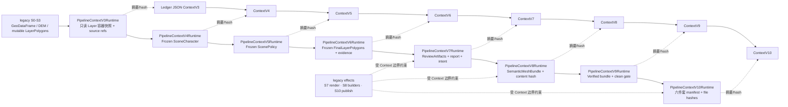
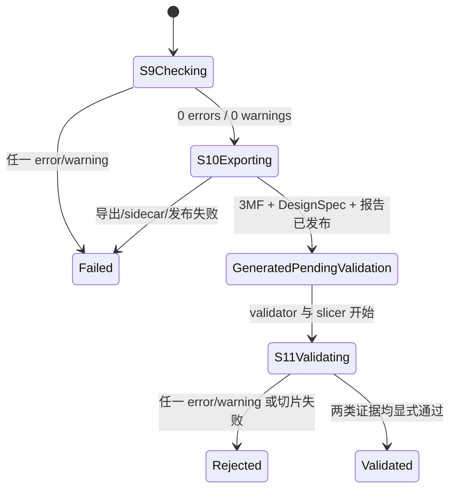

# 生成 Pipeline 架构审计与迁移说明

> 审计日期：2026-08-31
>
> 审计对象：`aesthetic/pipeline_contract.py`、`aesthetic/pipeline_ledger.py`、
> `aesthetic/pipeline_orchestration.py`、`aesthetic/pipeline_gates.py`、
> `aesthetic/pipeline_observation.py`、`aesthetic/pipeline_domain.py`、
> `generate_city_legacy.py`、
> `webapp/pipeline_console.py` 及对应测试。
>
> 本文只描述生成、观测、导出和验收架构；不评价某一张城市图的审美结果。

## 结论先行

当前实现已经建立了一条可执行的 **S0–S11 canonical lifecycle**，但还不能声称
“整个生成器已经由严格、不可变、类型化的 `PipelineContext` 驱动”。准确状态如下：

| 能力 | 当前结论 | 证据或限制 |
|---|---|---|
| 唯一 Stage 定义 | **已强制** | `generation-pipeline-contract-v3` 是 S0–S11 名称、顺序、输入、输出、Context 类型、必需交接字段和模式终点的唯一注册表 |
| Stage 顺序、run/attempt/revision | **已强制** | attempt-scoped `PipelineLedger` 以持久 sidecar lock 覆盖 revision compare + atomic replace；macOS/Linux/WSL 使用 `flock`，原生 Windows 使用 `msvcrt`，拒绝越级、并发旧 revision 覆盖和跨 attempt 取错状态 |
| 单向 Context 证据链 | **已强制** | ledger 自动把上一 Stage 的 `context_out` 作为下一 Stage 的 `context_in`，校验 mapping、Stage 必需字段、类型标签与 JSON 哈希；还把 S6 非零语义族绑定到 S8 对应 mesh，把 S8 的顶点/面数、水密、绕向和 bounds 绑定到 S9，并把 S10 3MF hash 绑定到 S11 |
| 单向领域对象执行链 | **S3→S10 已串联，effects 仍在迁移** | 生产入口实际执行 exact V3→V10 runtime chain：V8 持有七类 opaque mesh handle、完整坐标/拓扑 SHA-256 和 S9 输入，V9 只读门禁前重验 mesh，V10 导出前再次重验并绑定六件套逐文件 SHA-256；S4–S10 ledger handoff 全由实际 Context 派生并核对 run/attempt。S0–S3 尚未对象化，S7/S8/S10 的渲染、builder 与文件 effect 仍在 legacy 大函数中 |
| S9 导出前硬门禁 | **已接入但范围有限** | `semantic-mesh-gate-v1` 要求本次实际角色集合与逐角色 metrics 精确对应，terrain 必须存在，每个角色须有正顶点/面、有限有序 bounds、水密且绕向一致；另执行 `binary_nonzero_survival`。它不检查保留率，也不等于重开 3MF 或真实切片 |
| S10 与 S11 分离 | **已在状态模型中强制** | S10 完成后只能得到 `generated_pending_validation`；S11 保持 `pending_validation` |
| S11 生产闭环 | **已强制到受信边界** | `pipeline_acceptance.py` 重新运行项目 validator，并校验与 S10 3MF hash 绑定的 slicer JSON 声明，再推进同一 attempt ledger；JSON 是受信 operator/worker 的声明，不是切片器运行的密码学证明 |
| attempt 产物隔离 | **正式 sidecar 已完成** | 3MF、DesignSpec、measurement/observation、SceneCharacter、ScenePolicy、CompositionSpec 使用 run/attempt 文件名；固定文件名只是不进入 ledger 的 latest convenience alias |
| 管理员全过程可视化 | **主要链路已完成** | contract + ledger + heartbeat + sidecar + observation 构成只读投影；先匹配 run/attempt identity，再选择该 identity 的最高 revision，并显示 Context 类型/必需键、前序输出→本级输入的实际 hash 交接、artifact Stage 来源和 S9 要素存活证据；现代任务缺少 exact Ledger 时明确显示“证据缺失”，不按日志百分比猜完成 |
| 客户任务产物找回 | **主 UI 已绑定 attempt** | 正常页面通过 `/api/jobs/{job_id}/artifacts` 读取该 job/attempt ledger 声明且实际 size/hash 一致的产物，不再按 city 猜 latest；旧 `/api/artifacts/{city}` 和宽泛 `/files` 仍是待迁移的访问控制债务 |
| 所有生成入口共用契约 | **尚未完成** | canonical ledger 当前直接接在 `generate_city_legacy.py`；`generate_city.py`、`generate_cli.py`、部分 gallery/fast-draft 工具仍是旁路 |

因此，当前最合适的表述是：

> **生命周期、审计链和正式验收闭环已经结构化；S3→S10 的领域 Context 已进入
> 生产，S0→S3、effect 抽取与旁路入口仍在迁移中。**

## 1. Canonical contract：真实阶段与运行模式

`generation-pipeline-contract-v3` 固定以下阶段。名称和边界不再由日志中的
`Stage 4.5`、`Stage 8.5` 等历史编号决定。

| Stage | 契约职责 | `generate_city_legacy.py` 当前真实工作 | 当前 Context 证据 |
|---|---|---|---|
| S0 解析运行配置 | 固定任务、范围、比例、打印约束和数据源身份 | 解析 CLI；确定 bbox、scale、分辨率、打印档案、PBF 和运行模式 | 城市、精确/取数 bbox、面积、比例、printer profile、PBF 文件名 |
| S1 获取原始数据 | 获取 OSM/DEM 等原始输入并保留来源证据 | 读取 DEM、可选 nDSM，提取建筑/道路/水体/植被/landuse；总要素为零或默认 DEM 取数失败即停止 | 原始要素数、DEM status/shape/range、osmium backend |
| S2 投影、源测量与预处理参数 | 坐标转换、裁切、非零检查，并解析 S3 所需参数 | WGS84 → UTM；统计投影来源；运行 legacy CityProfile/auto resolver；冻结 JSON-safe `preprocess_parameters` 与内容 SHA-256；建立 `TerrainSurfacePlan`。DEM smoothing 若此时才解析，只记录 deferred，不回改 S1 | 投影后数量、CRS、本地 bbox、完整参数快照及 fingerprint、terrain plan fingerprint |
| S3 消费参数并预处理/构图 | 使用 S2 参数快照形成角色化基础图层和 topology | cache identity 与 effective overrides/hotspot 已绑定 S2 fingerprint；其余执行仍部分依赖 bbox/scale/printer/Amap 等 legacy 局部变量，尚非纯 Context handler | BL/BO/WL/WO/VL/VO/roads/block-base 数量、policy version、所消费参数 fingerprint |
| S4 城市与地貌观测 | 只读测量城市、地貌、数据质量和打印尺度 | `run_s4_observation(PipelineContextV3Runtime)` 生成并冻结 `SceneCharacter`、Block Grammar、外部城市证据和数据质量 | SceneCharacter 版本/状态、source quality、terrain fingerprint、character fingerprint、runtime Context 类型 |
| S5 下游生成策略解析 | 把 S4 测量解析为只供 S6–S8 消费的有界策略 | `run_s5_policy(PipelineContextV4Runtime)` 从 character 的 fresh builder 生成并冻结 `ScenePolicy`；不能回改 S3，也不得直接控制 mesh 顶点、全局 Z 或布尔运算 | scene class、archetype、activation、继承 character fingerprint、输出 policy fingerprint、runtime Context 类型 |
| S6 建筑中频与高度层级 | 产生最终建筑语义图层与高度角色 | `run_s6_building_roles(PipelineContextV5Runtime)` 只 thaw 一份私有 Layer 容器，按原顺序执行细针路由、建筑聚合、可选区域强调与 terrain-owned 高度约束，再冻结为 V6 | final layer 数量、完整 Layer WKB/语义内容 fingerprint、building-role evidence fingerprint 与 runtime Context 类型 |
| S7 诊断证据与构图 | 从最终语义图层产生评审证据 | 所有 legacy consumer 先从 V6 thaw 私有图层；生成 `CompositionSpec`、测量报告、可选 PNG/GLB，最后由 `run_s7_review` 校验 run/attempt、城市、bbox、terrain、Character/Policy 后封装为 V7。effect 函数本身仍待进一步移出大函数 | 评审产物名、CompositionSpec/measurement/review fingerprint、terminal mode、runtime Context 类型 |
| S8 生成语义网格 | 为正式模式生成各语义 mesh | materialize terrain plan；生成七类语义 mesh；`run_s8_mesh_materialization(V7)` 统一派生必需角色、最终数量和门禁输入并封装 V8 | mesh summary、完整 mesh bundle/summary/materialization fingerprints、water relief status、runtime Context 类型 |
| S9 间隙与几何检查 | 导出前 fail-closed 门禁 | `run_s9_mesh_gate(V8)` 先重验 mesh bundle fingerprint，再对必需语义 mesh、Block Base 间隙和来源语义族存活执行硬检查；不修复 mesh | gate version、0/0、mesh metrics、feature survival、gate/verified-bundle fingerprints、runtime Context 类型 |
| S10 导出交付产物 | 输出可追溯 artifact bundle | `require_s10_export_context(V9)` 在任何导出 effect 前重验 bundle/gate；暂存并发布六件套；`run_s10_artifact_bundle(V9)` 逐文件稳定读取并绑定 SHA-256 后封装 V10 | 精确六件套 manifest、逐件 size/hash、artifact bundle fingerprint、S9 0/0、runtime Context 类型 |
| S11 正式验收 | 重开交付物并核对 validator 与受信切片声明 | 主生成器之后由 `tools/accept_pipeline_artifact.py` 重跑 validator、验证 hash-bound slicer evidence 声明并推进同一 ledger；代码不启动或证明切片器运行 | `pipeline-acceptance-v1`、validator/slicer 声明、`validated` 或 `validation_rejected` |

运行模式必须是 canonical chain 的连续前缀：

| mode | 实际终点 | 明确不执行 |
|---|---|---|
| `fetch` | S1 | S2–S11 为 `not_applicable` |
| `styles` | S7 | S8–S11 为 `not_applicable` |
| `review` | S7 | S8–S11 为 `not_applicable` |
| `draft` | S7 | S8–S11 为 `not_applicable`；GLB 是评审产物，不是正式 mesh |
| `full` | S11 | S10 后先停在待验收；只有 acceptance CLI 成功后才进入 `validated` |

### 历史日志编号不是新 Stage

`generate_city_legacy.py` 内仍保留 `[Stage 1b]`、`[Stage 3d]`、`[Stage 4.5]`、
`[Stage 8.5]` 等日志。这些是旧调试标签，只表示一个函数块的位置，不能用于 ledger、
管理员页面、重试策略或验收判断。新代码和新文档必须使用 S0–S11 ID。

### S1 DEM 失败策略

`generate_city_legacy.py` 默认 fail-closed：DEM 获取失败会终止运行，不再静默生成 0 m
平面。只有诊断任务显式传 `--allow-flat-dem-fallback` 才允许降级；此时 S1 的
`dem_evidence` 必须记录 `status=flat_fallback`、来源、shape、0 m range 和原始失败类型，
不能把它伪装成可正式验收的真实地形。提供本地 DEM 时应优先使用
`--elevation-file <path>`。

## 2. 单向 Context：已经保证了什么，尚未保证什么

### 2.1 已经保证的生命周期不变量

`pipeline_contract.py` 在 import 时检查：

1. Stage 必须严格为 S0–S11，`order` 连续；
2. `S(n).context_out == S(n+1).context_in`；
3. 每种 mode 都只能是 canonical chain 的连续前缀；
4. 每个 `StageSpec` 声明该 Stage 输出摘要的 `required_context_keys`。

`PipelineLedger` 进一步保证：

1. 同一时刻只有一个 Stage 为 `running`；
2. 不能越级开始 Stage；
3. 下一 Stage 自动继承上一 Stage 的 Context record；
4. `complete_stage()` 与 `reject_validation()` 拒绝非 mapping 或缺少本 Stage 必需字段的
   `context_out`；S9 必须 `passed=true`、零 errors/warnings 且来源要素存活，S10 必须
   声明完整且与 ledger 实录名称完全一致的六件套、继承 S9 0/0，S11 成功必须同时声明
   validator 与 slicer 通过；
5. 显式传入的 Context 必须与上一输出哈希相同；
6. 失败 attempt 不能继续；
7. 同一 attempt 的 revision compare 与原子替换处在同一跨进程锁内；并发 stale writer
   不能覆盖新 revision；
8. artifact 必须位于该输出根目录内，并记录相对路径、字节数和 SHA-256。
9. producer 的每次 commit 在写盘前也运行完整
   `validate_pipeline_ledger_state()`；local load、worker 和管理员复用同一状态定义。
10. v3 将 preprocess、投影来源数量和 terrain fingerprint 从 S2 连续携带到 S10，将
    SceneCharacter/ScenePolicy fingerprint 从其产生 Stage 连续携带到 S10；S9 survival
    必须与 S2 来源数量 fingerprint 一致。
11. S0–S8 不再只检查“key 存在”：S0 校验 mode/bbox/比例/打印档案；S1 校验非零来源
    计数与一致的 DEM fallback 证据；S2 校验投影计数、局部 bbox 和内容绑定 fingerprint；
    S3–S7 校验阶段特有状态/计数；S8 至少要求非空 terrain mesh 摘要。它们仍是摘要
    schema，不是 GeoDataFrame/mesh 领域对象的完整类型系统。
12. 跨 Stage 证据不能各说各话：S6 的非零 roads/water/vegetation/BL/BO 必须分别走到
    S8 的 roads/water/vegetation/landmarks/buildings-or-block-base mesh；S9 的 ready
    角色以及 vertices/faces/watertight/winding/bounds 必须与 S8 `mesh_summary` 一致；
    S9 四类 `final_count` 必须与 S6 最终图层数一致；S11 的 `artifact_sha256` 必须等于
    S10 唯一 3MF claim 的 SHA-256。旧 v3 Ledger 只在明确的五位 bounds/缺 winding
    兼容路径下读取，新写入的 `semantic-mesh-summary-v2` 不降级。

这使得“状态说 S6 已完成、S5 却没有输出”或“另一个用户的同城 retry 被当成本任务”
成为可检测错误。

### 2.2 已接入的第一段领域 Context 与剩余边界

ledger docstring 已明确说明：它 **records what happened; it never supplies geometry
values back to the generator**。v2 会校验 mapping、必需键和 S9/S10/S11 的关键成功
语义，但不会验证每个普通字段的完整领域类型，也不会让 JSON 摘要替代真实几何。当前
record 中的 Context 仍是有限摘要，并不能替代实际的 `RawData`、`ProjectedData`、
`FinalLayerPolygons` 或 `SemanticMeshBundle`。不过生产执行已不再完全是两条互不相干的
轨道：`aesthetic/pipeline_domain.py` 已把 S3→S10 的对象交接接入
`generate_city_legacy.py`。

当前真实边界是：



该 runtime Context 与 ledger Context 有意分层：前者可持有不能 JSON 序列化的领域对象，
后者只持久化有界摘要、artifact claim 和 hash。当前实现保证：

1. S4–S10 入口做 exact predecessor 类型检查，不接受跳级 Context；
2. SceneCharacter、ScenePolicy 和 S6/S7 evidence 在出口递归冻结，下一 Stage 会在执行
   副作用前复核内容 fingerprint；V6 还按全部 Layer 字段和 geometry WKB 计算最终语义
   图层 fingerprint，可区分“数量相同、几何不同”的结果；
3. `LayerPolygons` 的 list/dict/set 容器在 Context 内转换为只读 snapshot，Shapely 几何
   因不可变而共享；S6 只 thaw 一次私有容器，运行现有算法后重新冻结；S7 和 S8 分别
   thaw 自己的工作副本，不能通过同一 list/dict 相互污染；
4. 没有改动任何道路、水体、建筑聚合、Z、布尔或审美参数；这次迁移只改变对象所有权
   和调用边界；
5. Ledger 的 S4–S10 context_out 不再手写 runtime 链，而是调用
   `context_handoff_ledger_value()` 从实际 Context 派生；写入前核对 Context identity 与
   active ledger 的 run/attempt。V7 同时拒绝来自另一次 attempt、另一城市/bbox、不同
   terrain 或不同 SceneCharacter/ScenePolicy 的测量报告与构图证据；
6. V8 不复制大 mesh，而冻结 role mapping 并按 vertices/faces 字节计算内容 SHA-256；
   V9 在门禁执行前复核，S10 在 exporter/file effect 前再次复核。V10 要求精确六件套，
   对每个已发布文件做稳定读取并记录 filename、size 和 SHA-256；
7. 管理员 Stage 详情读取上述持久 evidence，显示 runtime Context in/out、版本和内容
   指纹；页面仍是只读投影，不能反向控制生成。

仍未严格冻结的是 projected GeoDataFrame、DEM/AMap 数组等大对象；当前
`RuntimeInputs` 把它们作为本 attempt 的只读 opaque reference 传给现有消费者，以避免
25 km 任务产生多份高成本内存副本。S0–S3 的领域 handler、S7/S8/S10 effect 函数移出
大过程函数，以及旁路入口统一，仍是后续迁移。

`aesthetic/pipeline_orchestration.py` 另提供一个无几何依赖的正确执行缝：handler 只能
接收上一 Context 的副本、必须返回新 Context，S9/S11 必须显式 `gate_passed=True`。
它目前仍只被单元测试使用；生产 S3→S10 使用的是上述领域对象 adapter，而不是把
GeoDataFrame 强塞进 JSON orchestration。

所以“每个 Stage 的输出都是下一级唯一输入”在 **S3→S10 对象链已成立**，在整个
S0→S11 仍是迁移目标。下一步应继续 adapter-first 抽取 S7/S8/S10 effects 与 S0–S3，不应借
重构之名同时修改道路、水体、建筑或 Z 的视觉算法。

当前应把两套策略边界理解为：S2 在投影来源上做 CityProfile/auto parameter 测量并
解析 JSON-safe 参数快照，内容 fingerprint 进入 S3 Context 和 preprocess cache key；S3
已从快照读取 effective overrides/hotspot，但仍直接使用部分 legacy 局部变量，并未成为
只接收 `PreprocessParameters` 的纯 handler。S3 随即完成道路、水体、topology 和基础
建筑层；S4 再对
这些结果做 SceneCharacter 只读测量；S5 的 ScenePolicy **只允许影响 S6–S8** 的建筑
中频、高度、构图证据和 mesh 构建。S5 中面向道路/水体的建议目前是审计信息，不会也
不应跨 Stage 回写 S3。这样避免同一参数被“先 legacy resolver 一次、再 ScenePolicy
一次”隐式重复作用，但生产代码仍需从模块级 `_cfg` mutation 迁移到显式 Context 字段。

### 2.3 `pipeline-domain-context-v1` 回归证据

本次迁移没有调整阈值、线宽、建筑聚合、高度或网格算法。验证分三层：

1. 定向单元/接线测试覆盖 exact predecessor、递归只读 JSON、Layer freeze/thaw、S6
   不污染 V3、fingerprint 篡改拒绝、S7 完整证据要求、V8 mesh mutation 拒绝、V9 clean
   gate 以及 V10 精确六件套/逐文件 hash；定向套件 `166 passed`；
2. 全量非慢速测试：`980 passed, 2 skipped, 11 deselected`；
3. 真实芝加哥路径：
   - 0.9 km² audit review-only：S0→S7 完成；
   - 0.9 km² active review-only：S6 实际激活 building mass，输出 240 components；
   - 0.9 km² identity-binding review-only：S4→S7 的 ledger evidence 全部由 Runtime
     Context 派生，V6/V7 的最终图层、building evidence、CompositionSpec、measurement
     和 review fingerprint 均可从持久 ledger 读回；
   - 25.0 km²（约 5 km × 5 km）formal：S6 输出 2,146 building-mass components，
     S8 生成 terrain/landmarks/buildings/roads/water/block-base，S9 明确
     `0 errors / 0 warnings`，S10 输出 11.41 MB 多对象 3MF 和 attempt-scoped
     DesignSpec/measurement/observation 六件套；
   - 项目 validator V1–V17 全部通过，`strict_passed=true`、
     `errors=[]`、`warnings=[]`。
4. V8→V10 生产 Context 回归使用同一芝加哥 5 km 框：run
   `c93a01f389fe45318fb2da92a2654a05`、attempt
   `b51b432e76be4fbc9bda1c6dade3240f`。V8→V9→V10 的 mesh fingerprint
   `1d9f431e…` 连续一致；V9 gate fingerprint `bdde1bb4…` 被 V10 继承；V10 六件套
   fingerprint `2f532120…`，S9 为 0/0。真实 11.41 MiB 3MF 由 V1–V17 重开验证，
   0 errors / 0 warnings。另一个 0.9 km² 小框因 10 个投影水体在最终层归零而被 S9
   正确拦截，证明迁移没有绕过 fail-closed gate。

正式回归命令（使用本地已有 PBF 和 DEM cache）为：

```bash
.venv/bin/python generate_city_legacy.py \
  --bbox 41.8601,-87.6528,41.9051,-87.5924 \
  --pbf pbf_cache/illinois-latest.osm.pbf \
  --city pipeline_domain_chicago_5km \
  --auto-params --no-vegetation --no-snap

.venv/bin/python tools/validate_3mf.py \
  output/pipeline_domain_chicago_5km/<attempt-scoped>.3mf \
  --design-spec output/pipeline_domain_chicago_5km/<attempt-scoped-design-spec>.json
```

这证明 adapter 没有阻断真实对象链与正式导出；它仍不是实体打印证明，也没有替代
S11 的受信 slicer evidence。

## 3. S9 是导出前门禁，不是最终验收

当前 `semantic-mesh-gate-v1` 对本次请求中应存在的语义角色逐个检查：

- mesh 存在且有非空 XYZ vertices；
- 顶点有限，不含 NaN/Inf；
- faces 为非空三角面且索引不越界；
- `is_watertight`；
- `is_winding_consistent`；
- bounds 有限；
- 当 Block Base 存在道路切线时，必须有 `checked`、`passed` 的间隙证据，
  `verified_min_gap_mm >= target_gap_mm`，且裁切后侵入面积不超过容差；
- `feature-survival-v1` 的 scope 明确为 `binary_nonzero_survival`：比较 S2 的投影来源与 S6/S9 最终层；来源中存在的道路、水体、
  建筑或启用的植被若在最终层归零，S9 直接失败；显式 `--no-vegetation` 会记录为
  `intentionally_omitted`，不能用“未加入 required_roles”绕过；
- 任意 error 或 warning 都阻止 S10。

但 S9 **目前没有**：

- 证明合理的保留率、道路/水体连通性、城市身份或视觉质量；例如来源 10,000 → 最终
  1 仍满足这个二值底线，来源计数与最终对象计数也不是同单位质量指标；

- 重开刚导出的 3MF（因为此时还没有导出）；
- 验证 3MF ZIP/XML、对象/材料映射和 DesignSpec 一致性；
- 运行真实切片器；
- 证明缝隙在具体喷嘴、层高和切片策略下仍然存活；
- 完整检查所有跨对象碰撞、悬空、孤岛或最终 G-code；
- 在这个 Stage 内自动做通用 Manifold 修复。

几何修复应由 S8 的显式 builder/repair 步骤完成并产生证据；S9 应保持 fail-closed，
不能“检测失败后偷偷改 mesh 再继续”。因此 canonical 文案应把 S9 理解为
“间隙与几何门禁”，而不是一个不可审计的自动修复黑盒。

## 4. S10 生成与 S11 验收必须分开

正确状态机是：



S10 当前采用 attempt staging 目录，先发布 sidecar，最后用 `os.replace` 发布 3MF，
避免出现“新 3MF 已下载但 DesignSpec/报告还没形成”的假成功。完成 S10 后 ledger 会：

- 把 S10 标为 `completed`；
- 把 run 标为 `generated_pending_validation`；
- 把 S11 标为 `pending_validation`；
- 把 `current_stage_id` 指向 S11。

发布后的权威文件也带 run/attempt identity：3MF、
`design_spec.<run>.<attempt>.json`、
`pipeline_measurement_report.<run>.<attempt>.json/html` 和
`pipeline_observation.<run>.<attempt>.json/html` 由 S10 ledger 记录路径、大小与 hash；
S4/S5/S7 的 SceneCharacter、ScenePolicy、CompositionSpec 和 S7 measurement snapshot
同样 attempt-scoped。生成器随后原子刷新 `design_spec.json`、
`pipeline_measurement_report.html` 等固定名称，供人工和旧工具方便打开。这些 fixed
aliases 明确 **非权威、不进 ledger**；后续同城 attempt 覆盖它们不会破坏旧 ledger 的
artifact identity。

`aesthetic/pipeline_acceptance.py` 现已实现唯一受支持的生产 S11 转换。它会：

1. 读取指定 attempt ledger，并要求当前状态是 `generated_pending_validation`；
2. 要求 ledger 的 S10 恰好记录 canonical 六件套：3MF、DesignSpec、measurement
   JSON/HTML、observation JSON/HTML，不允许缺件或额外冒名；
3. 逐件重新计算 size/SHA-256，并约束输出根不能把 ledger 相对路径重新绑定到另一目录；
   3MF 还必须与 slicer evidence hash 一致；
4. 将 ledger 中 hash-verified、attempt-scoped 的 DesignSpec 路径显式传给项目 validator
   后重新运行，要求其内容中的 artifact filename/size/SHA-256 与 3MF 一致，且
   `passed=True`、`0 errors / 0 warnings`；不得读取同城可变的 `design_spec.json` alias；
5. 验证受信 slicer evidence 声明的 schema、工具名/版本、加载/切片完成状态及零问题
   结果；
6. 原子保存 validator report 和 `pipeline-acceptance-v1` AcceptanceReport，并把它们记录
   到同一 ledger 的 S11；
7. 两个门都通过才将 S11 置为 `completed`、run 置为 `validated`；任一验收门失败则
   保留 S10 `completed`，将 S11 置为 `rejected`、run 置为 `validation_rejected`。

若初始检查发现 3MF 已被篡改、指定路径不是 ledger 中的 S10 artifact，或 ledger 不是
待验收状态，命令会在启动 S11 前拒绝，原 ledger 继续保持
`generated_pending_validation`。通过初检后，命令先把 S11 标成 `running`，让管理员页
看到真实验收工作；随后在 evidence 持久化前和最终状态提交前再次核对路径、大小与
hash。六件套中的任一文件在验收期间发生 TOCTOU 变化都会使 S11=`failed`，而“artifact 身份稳定、
但 validator/slicer 声明不通过”才进入 S11=`rejected`、run=`validation_rejected`。

### 4.1 Slicer evidence 最小 schema

真实切片完成后，保存以下最小 JSON。`artifact_sha256` 必须是待验收 3MF 的实际哈希；
`status` 只接受 `passed` 或 `accepted`；warnings 也会使验收失败。

```json
{
  "schema_version": "slicer-acceptance-v1",
  "artifact_sha256": "<exact 64-character 3MF SHA-256>",
  "status": "passed",
  "errors": [],
  "warnings": [],
  "tool": {
    "name": "Bambu Studio",
    "version": "<actual slicer version>"
  },
  "checks": {
    "loaded": true,
    "sliced": true
  }
}
```

这个 schema 在当前**受信边界**内声明：提交它的受信 operator/worker 使用所列工具
加载并完成了切片。`artifact_sha256` 能防止证据误绑到另一份 3MF，严格 schema 能阻止
缺字段、泛化截图或无 hash 的 PASS 被接受；但 JSON 本身没有切片器签名、远程证明或
防伪能力，拥有提交权限的一方仍可伪造它。因此它不是“真实切片器确实运行”的密码学
证明，更不能证明实体打印成功。若要提高保证等级，需要由受控 worker 直接捕获切片器
退出码/日志/输出文件 hash，或引入可验证签名与不可篡改运行记录。

### 4.2 正式关闭 S11

```bash
.venv/bin/python tools/accept_pipeline_artifact.py \
  --ledger output/<city>/.pipeline_runs/pipeline_state.<run>.<attempt>.json \
  --3mf output/<city>/<artifact>.3mf \
  --slicer-report output/<city>/<slicer-evidence>.json
```

当 ledger 不在默认的 `<city>/.pipeline_runs/` 结构时，再显式传
`--output-dir output/<city>`。命令会自行重跑项目 validator；无需先把独立 validator
结果作为可信输入。成功退出码为 0，验收拒绝退出码为 1。输出目录新增：

- `validator_report.<run>.<attempt>.json`；
- `acceptance_report.<run>.<attempt>.json`。

低层 `PipelineLedger.complete_stage("S11")` 仍是通用 ledger 原语；生产代码不得直接
调用它伪造验收，受支持入口只有 `accept_pipeline_artifact()`/上述 CLI。

## 5. 管理员 Pipeline 页面读取什么

管理员页面是只读观测面，不是生成控制面。它不向 mesh builder 回写任何数据，也不
向普通用户公开实现证据。

### 5.1 状态与 Context 权威选择

对一个明确的 job，`webapp/pipeline_console.py` 不再把 heartbeat 或磁盘位置本身当作
权威等级。它按以下规则取证：

1. 同时收集 heartbeat 内联 ledger 与本地 attempt-scoped ledger；
2. 使用与 `PipelineLedger.load()`、worker heartbeat/full upload 相同的
   `validate_pipeline_ledger_state()`，先要求 schema/contract/mode、run/attempt identity、Stage 顺序和状态、Context
   type/hash/必需键与 S9/S10/S11 成功语义全部合法；
3. 若 job 已固定 attempt，只比较同一 run/attempt 的 revision，最高 revision 权威；若
   尚未固定 attempt，先选择该 run 最近更新的 attempt，再取该 attempt 最高 revision；
4. 旧 `pipeline_state.json` 只对**没有固定 attempt 的历史任务**作兼容 fallback；现代
   job 一旦有 `pipeline_attempt_id`，exact Ledger 缺失或损坏即 fail-closed，页面显示
   `exact_ledger_missing`，不能串读旧 retry；
5. 每个 Stage 的 Context 优先取 ledger 摘要，其次取 job/日志/直接 sidecar 的 live
   context，最后才取 post-run `pipeline_observation.json`；
6. 只有未绑定 attempt 的 legacy job 才允许由 job status、progress threshold 和产物
   推断，并明确标为 `legacy_inferred`；绑定 attempt 的任务不得走这条兼容路径。

同城并发和 retry 不能使用“该城市目录里最新的状态文件”来猜任务身份，也不能假设
heartbeat 一定比 API 主机上刚完成的 S11 新。选择顺序始终是 identity → revision，
transport 只说明副本来自哪里。

共享 core validator 只验证状态机、Context record 以及 artifact claim/index 的语义，
不自动读取所有 artifact 文件。worker full upload 额外要求上传 manifest 等于全部 ledger
claims 加 ledger 本身并逐文件核对 size/hash；管理员读取有 ledger 的 JSON sidecar 时只按
该 attempt 的 claim 定位并再次核对 size/hash，无 ledger 时才允许固定 legacy alias。

### 5.2 页面能展示的内容

- canonical Stage 的名称、输入和输出；
- 每个 Stage 的 `required_context_keys`；
- Stage 状态、开始/完成时间和状态来源；
- run/attempt/revision 身份（来自 ledger 时）；
- `context_in → context_out` 类型、`required_context_keys` 和压缩后的只读 Context；
- 前一 Stage `context_out.sha256` 与本 Stage `context_in.sha256` 的实际交接状态和短 hash；
- 本 Stage 产物、最近持久化事件；
- S4 测量覆盖、measurement → decision → consumer 链；
- S9 的道路/水体/建筑/植被“投影来源数 → 最终层数 → survived/lost/omitted”；
- S10 交付包与 S11 验收的不同状态。

`pipeline_observation.html/json` 是**运行后投影**：它展示 canonical
`context_in/context_out`、输入、输出、状态来源、run/attempt/revision、S10 generation
gate 与 S11 acceptance gate。它不会证明这些 Context 是生产 handler 的领域输入。
为避免自引用 hash，S10 observation 在 S10 commit 前写入，因此内嵌的 ledger snapshot
诚实显示 S10=`running`；文件发布后管理员页面会读取 revision 更高的 live ledger，显示
S10=`completed`。页面不得把 observation 中的预期路径反向当作 ledger 完成证据。

路径输出会折叠为文件名或显式相对路径；token、secret、password、authorization、
command 和 environment 不进入管理员投影。完整测量报告与 pipeline 文件由服务器的
管理员权限中间件保护。

### 5.3 可视化仍有的限制

- 没有 ledger 且未绑定 attempt 的 quality/gallery/fast-draft 旁路只能看到推断状态；
  已绑定 attempt 的现代任务会显示“精确 Ledger 缺失”，不会伪造完成 Stage；
- progress threshold 是 UI 提示，不是 Stage 完成证据；
- job `done` 不是 S11 通过；validator-only 的 0 errors / 0 warnings 结果现在仍显示
  `pending_validation`，只有合法 `pipeline-acceptance-v1` 报告或同一 ledger 的
  `validated` 状态才显示完成；
- measurement report 很大，轮询 API 只返回摘要，完整证据需打开管理员产物。
- 正常客户页面已经按 job/attempt 恢复产物；但兼容性的 city-latest API 与 `/files`
  静态挂载尚未完成全量 ACL 收口，因此目前是“避免串任务展示”，还不是完整的客户文件
  访问隔离。公开部署前应把客户成品迁入任务下载接口，只对白名单样品保留静态公开。

管理员页面按 ledger 中的 artifact `stage_id` 显示来源 Stage，而不是只靠文件名猜测。
有合法 attempt ledger 时，也会隐藏同一城市目录里其他 attempt 的 sidecar。固定别名
（如 `design_spec.json`）只表示“最近一次方便打开的副本”，不参与该 attempt 的权威
产物判断。S11 状态同样只服从合法 ledger 的正式迁移；同 run/attempt 命名但未被
ledger claim 的 validator/acceptance report 只能被忽略，不能覆盖 pending 状态。

## 6. 入口覆盖审计

| 入口 | 用途 | canonical contract/ledger 状态 |
|---|---|---|
| `generate_city_legacy.py` | Web 通用城市、任意 bbox、review/draft/full | **已接入 S0–S10；full artifact 可由 acceptance CLI 严格关闭 S11** |
| `generate_city.py` | 当前西湖精细固定入口 | **未迁移**；仍使用历史 Stage 编号和过程式控制 |
| `generate_cli.py` | 另一套通用 CLI | **未迁移**；与 canonical 入口重叠，存在行为漂移风险 |
| `tools/gen_area_gallery.py` | styles/画廊 | **需单独核对/迁移**；Web 设置 mode 不等于脚本自动产生 ledger |
| `tools/generate_gallery_draft.py` | 缓存命中的快速 draft | **旁路**；当前不能假定拥有 S0–S7 ledger |

这意味着管理员页面对 `generate_city_legacy.py` 的观测最可信；不能因为 Web API 给所有
任务都分配了 `pipeline_attempt_id`，就宣称所有被调用脚本都写了 canonical ledger。

## 7. 残余技术债与优先级

S11 状态分离、artifact hash 绑定、验收拒绝状态、validator-only 管理员误判、S9 来源
要素存活、正式 sidecar attempt 隔离和 ledger 并发 CAS 已完成，不再列入技术债。下面
只列仍未完成的工作。

### P0：影响“结果是否真的可打印”或“状态是否可信”

1. **收敛生产入口**：把 `generate_city.py`、gallery/styles、fast draft 迁入同一 contract
   adapter，或明确下线/标记 legacy；不能继续维护多个“正式入口”。
2. **提取领域 Stage Context**：先包装既有对象，再逐步把 S0–S10 变成
   `ContextN -> ContextN+1` handler；生产调度器最终使用 orchestration seam。
3. **提高 slicer 证据保证等级**：当前 JSON 是与 artifact hash 绑定的受信声明，不是
   切片器签名。生产化应让受控 worker 直接运行并捕获退出码、日志、输出 hash，必要时
   对 evidence 签名；实际打印仍是更高一级的独立验收。
4. **收口客户产物访问**：移除 customer output 的 city-latest 恢复语义；`/files` 只公开
   gallery/showcase 白名单，其他文件必须经 job owner/share-token 检查后下载。当前任务级
   API 已解决页面拿错同城 attempt，但不能阻止已知裸路径绕过。

### P1：影响边界清晰度和可回归性

1. 把旧日志 `Stage 4.5/8.5` 改为 canonical Sx + Stage 内 step 名称。
2. 明确 S9 只检查、S8 才修复；来源语义族归零已被阻断，仍需扩大门禁到更完整的跨
   对象嵌入、贴地/悬空、孤岛和 material/object 对应关系，但不要用隐式修复掩盖失败。
3. 把必须影响原始取数/DEM 的自动参数提前到 S0/S1；当前 S2 才解析出的
   `elevation_smoothing_sigma` 只能标为 next-attempt/deferred。
4. 把 S2 的 legacy `_cfg` mutation 改为显式 `PreprocessParameters` 领域对象，并让 S3
   真正只消费该对象；把 S4/S5 的 semantic fingerprint 与对应 JSON payload 在边界处
   重算绑定（当前只强制 required + carried equality，sidecar 字节另由 artifact hash
   保护）；保证 S5 只向 S6–S8 输出策略，不能形成跨 Stage 回写。

### P2：工程完善

1. 用实测 Stage 时间而非静态百分比改善进度估计，但百分比不能替代 ledger 状态。
2. 扩展 S10 bundle manifest 的跨文件关系；worker 上传已校验 manifest/ledger/hash，
   仍可增加 bundle 自身签名和长期归档索引。
3. 将 `pipeline_measurement_report` 的大字段按需分页/下载，保持运行中轮询轻量。
4. 为固定 latest aliases 增加明确的 UI 标签和清理策略；它们不可用于历史任务复现、
   hash 验收或管理员 Stage 归属。

## 8. 建议迁移顺序

迁移必须避免同时改变架构和视觉结果。每个切片都应能用相同输入做 A/B：

1. **冻结 contract/ledger/gate 行为**：把现有测试作为结构基线。
2. **只加 adapter**：定义 `ContextV0..V10` dataclass，字段先引用现有对象；输出 mesh、
   PNG、3MF 哈希必须与旧路径一致。
3. **按 S4 → S7 先拆测量/策略层**：这些 Stage 副作用最少，最适合验证单向 Context。
4. **再拆 S8/S9/S10**：保留 builder 参数与次序，S9 继续 fail-closed，S10 继续最后发布
   3MF。
5. **把 S0–S3 取数/投影拆出**：在缓存 key 和 source identity 测试齐全后再动，避免
   误把缓存命中差异当成几何回归。
6. **迁移/下线旁路入口**：每个公开入口都必须声明 mode、terminal Stage 和 ledger
   identity。

## 9. 回归矩阵

以下矩阵区分“结构测试”“几何单元测试”和“真实打印验收”。任何一层通过都不能冒充
下一层。

| 层级 | 命令/动作 | 必须证明 | 不能证明 |
|---|---|---|---|
| Contract | `.venv/bin/python -m pytest -q tests/test_pipeline_contract.py` | S0–S11 顺序、Context 类型链、mode 连续前缀，S2 参数/来源/terrain 内容绑定及 S9 来源 identity | 生产生成器真的只消费上一 Context |
| Ledger + orchestration | `.venv/bin/python -m pytest -q tests/test_pipeline_ledger.py tests/test_pipeline_orchestration.py` | attempt/revision、并发 stale writer 无丢更新、`.pipeline_runs` output root、越级拒绝、单向哈希、S9/S11 fail-closed 语义 | 真实几何质量 |
| DEM 失败策略 | `.venv/bin/python -m pytest -q tests/test_dem_pipeline_contract.py tests/test_elevation_tile_cache_version.py` | 拒绝 all-NaN/all-Inf/全零 DEM 与污染缓存，允许含真实起伏的海岸零值格，并验证显式诊断回退 evidence | DEM 数据源地理正确或地形审美通过 |
| 运行模式边界 | `.venv/bin/python -m pytest -q tests/test_pipeline_mode_resolution.py` | CLI 与 worker envelope mode 一致；冲突 fail-closed；fetch/styles 只在允许条件下覆盖 full 默认 | 各模式真实产物质量 |
| S9 gate | `.venv/bin/python -m pytest -q tests/test_pipeline_gates.py` | 缺对象、非水密、低于目标间隙，以及来源道路/水体/建筑/启用植被归零会阻断导出；明确 10,000→1 仍只算二值存活 | 保留率、连通性、视觉质量、导出后 3MF 和切片器结果 |
| 报告 | `.venv/bin/python -m pytest -q tests/test_pipeline_observation.py tests/test_measurement_report.py` | S10/S11 分离、作用链、路径/秘密脱敏 | 状态一定来自实时 ledger |
| attempt 产物发布 | `.venv/bin/python -m pytest -q tests/test_generator_pipeline_wiring.py` | 3MF/正式 sidecar 使用 run/attempt 身份，ledger 只记录权威文件，固定 latest aliases 不污染 observation 链接 | 文件内容的几何质量 |
| 管理员投影 | `.venv/bin/python -m pytest -q tests/test_admin_pipeline_console.py` | identity 后最高 revision、非法 ledger fail-closed、Context 类型/必需键、ledger artifact Stage 来源、其他 attempt 隔离、S9 survival 与 S11 证据识别 | 所有旁路入口都有 ledger |
| Worker 协议 | `.venv/bin/python -m pytest -q tests/test_worker_protocol_v2.py tests/test_web_worker_queue.py` | retry 新 attempt、next/heartbeat/upload/finish 全程携带 request-side attempt、heartbeat revision 单调、空/错 hash manifest 拒绝、full/draft 必须到达各自 canonical 终点、full 六件套与 S10 ledger 身份绑定、上传和发布前二次 CAS 核对 lease/attempt | worker 所在机器的真实性或切片质量 |
| 正式 S11 验收 | `.venv/bin/python -m pytest -q tests/test_pipeline_acceptance.py tests/test_admin_pipeline_console.py` | 3MF hash 绑定、validator 0/0、slicer 声明 schema、`validated`/`validation_rejected`、validator-only 不误判、验收前后 TOCTOU 检查 | JSON 提交者没有伪造切片声明，或实体打印成功 |
| 任务产物身份 | `.venv/bin/python -m pytest -q tests/test_web_worker_queue.py tests/test_web_static_contract.py` | 页面恢复使用 job id、同城后续 attempt 不覆盖旧任务、未被 exact ledger claim 的 alias 不返回 | 裸 `/files` 已完成全量 ACL 收口 |
| 入口与冷导入 | `.venv/bin/python -m pytest -q tests/test_cold_imports.py tests/test_generate_city_entry.py` | 模块边界和旧入口 CLI 兼容 | 入口行为已经统一 |
| 3MF validator | `.venv/bin/python -m pytest -q tests/test_validator.py tests/test_validate_3mf_cli.py` | 最终 3MF 的项目规则和 0 warning 严格退出码 | 指定打印机一定可成功切片/打印 |
| 跨城市矩阵定义 | `.venv/bin/python -m pytest -q tests/test_regression_matrix.py` | Chicago/Beijing/Shanghai/Westlake 的 15/25 km 与 full 任务组合完整 | 这些真实城市已经重跑通过 |
| 非慢速总回归 | `.venv/bin/python -m pytest -m "not slow"` | 大范围逻辑回归 | 真实数据、性能和 slicer |

### 每次架构迁移的真实场景门禁

至少保留四类代表场景：

- 芝加哥：高密度网格 + 大水面；
- 北京：环路/放射骨架 + 地标；
- 上海：高密度路网 + 主河流连续性；
- 西湖：城市、湖泊、湿地和山体层级并存。

每座城市应执行 15 km topdown、25 km topdown；四城均执行 25 km full 3MF。正式
artifact 必须逐项确认：

1. 同一 run/attempt 的 S0–S10 ledger 连续且无跨任务 artifact；
2. OSM/DEM/关键要素数量非零，不能把“命令没报错”当成功；
3. ledger 中的 `design_spec.<run>.<attempt>.json` 存在并与同 attempt 3MF 对应；固定
   `design_spec.json` 只能作为 latest convenience alias 检查，不能代替权威文件；
4. S9 为 0 errors / 0 warnings，且 feature survival 中所有 expected 语义族均为
   `survived`；
5. 可先用
   `.venv/bin/python tools/validate_3mf.py <artifact.3mf> --design-spec <design_spec.run.attempt.json> --output <validation.json>`
   做独立诊断；该结果即使为 0 errors / 0 warnings，也不能单独关闭 S11；
6. 在受控环境用目标 printer profile 真实切片，至少按 4.1 的 schema 保存切片器名称、真实版本、
   `loaded=true`、`sliced=true`、零 errors/warnings 和该 3MF 的 SHA-256；层数、耗材、
   profile、切片器日志/退出码、输出文件 hash 与截图应作为扩展证据保留；JSON 仍只是
   受信声明，不能把它描述成不可伪造证明；
7. 对同一 ledger、同一 3MF 和该 slicer evidence 运行
   `tools/accept_pipeline_artifact.py`；由命令重跑项目 validator，并原子写入 S11 的
   validator report 与 AcceptanceReport；
8. 接受时必须确认退出码 0、run=`validated`、S11=`completed`；拒绝时必须确认退出码 1、
   run=`validation_rejected`、S11=`rejected`，且 S10 仍为 `completed`；
9. 视觉 A/B 另行人工评价，不能让结构测试自动批准审美变化。

Linux/云节点的耗时只能描述该节点本次运行，不能外推为 16 GB Mac 或 Windows 工作站
的性能结论。

### 本次真实冒烟证据（2026-08-31）

本机以芝加哥 5 km 框（约 25.0 km²）运行 `full`，run=`pipeline-audit-final-v4`、
attempt=`observation-bind-a1`：

- 原生 osmium；DEM 175.0–184.3 m；投影来源道路 21,223、水体 332、建筑 6,359；
- S9 存活结果道路 691、水体 9、建筑 894，vegetation 因显式 `--no-vegetation` 记为
  omitted；必需 mesh 为 terrain/landmarks/buildings/roads/water/block_base；
- 真实 3MF 为 9,603,935 bytes，S10 六件套逐件 size/SHA-256 与 ledger 一致；
- 项目验证器重开 3MF 后 V1–V17 全部通过，0 errors / 0 warnings；
- 另用旧 v3 attempt 重现了同城 latest DesignSpec 被后续 attempt 覆盖的场景；显式传入
  旧 attempt 自己的 DesignSpec 后 V1–V17 仍为 0/0，证明 validator 不再串用 alias；
- ledger revision 23，S0–S10 completed，run=`generated_pending_validation`，
  S11=`pending_validation`。没有提交真实切片器声明，因此没有把它伪装成 validated；
- observation 显示六件套完整；管理员 live 投影按 ledger revision 23 显示 S10 completed、
  S11 pending_validation，没有采用报告内 commit 前的旧 revision；S1–S10 的实际 Context
  handoff 均显示前序输出 hash 与本级输入 hash 一致；
- 加固 `semantic-mesh-summary-v2` 后，以上旧 v3 ledger 通过显式兼容路径重新加载；同一
  3MF 再次运行 V1–V17 仍为 0 errors / 0 warnings；完整非慢速回归为
  `967 passed, 2 skipped, 11 deselected`；
- Block Base 中间体的 trimesh 质心计算仍发出两条 divide-by-zero `RuntimeWarning`；最终
  Block Base 的水密/绕向、间隙及 3MF validator 均通过，但该中间退化体告警仍应单独
  定位，不能把 validator 的 0 warnings 描述成“整个进程从未告警”；
- 本次热缓存用时约 59.2 秒，只代表这台 Mac 的这次运行，不能外推其他节点。

## 10. 完成定义

只有同时满足以下条件，才能把架构迁移标为完成：

- 所有公开生成入口共享同一 `pipeline_contract.py`；
- 生产调度真正执行 `ContextN -> ContextN+1`，而非只写摘要 ledger；
- 所有权威中间和交付产物按 run/attempt 隔离并有 hash；固定 convenience alias 明确
  标为非权威且不进入 ledger；
- S9 失败无法进入 S10；
- S10 成功始终是 `generated_pending_validation`；
- S11 由绑定 artifact identity 的 validator + slicer 受信证据驱动，并明确记录其
  trust boundary；
- 管理员页面能区分 ledger 状态、旧推断状态和 post-run 投影，按 identity + 最高
  revision 选择权威副本，并展示 Context 契约与来源要素存活；
- 四类真实城市回归、项目验证器和真实切片全部留存证据。
